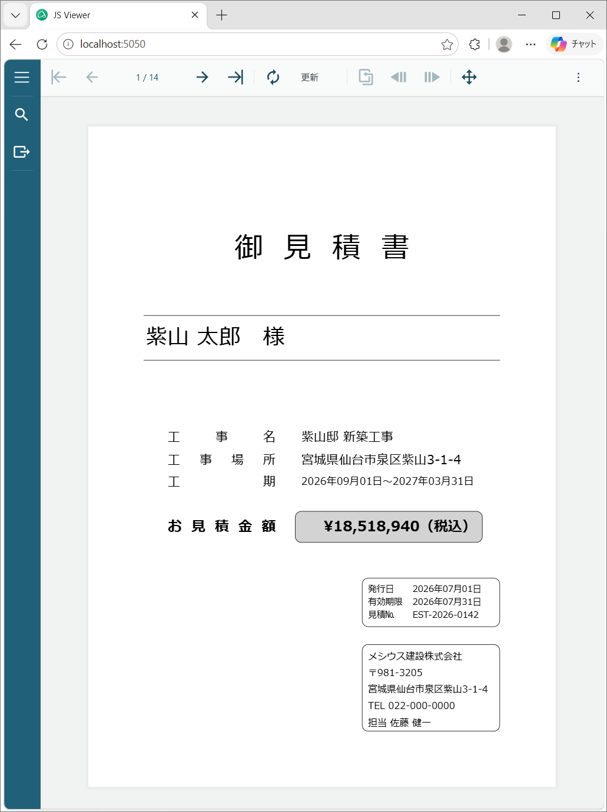
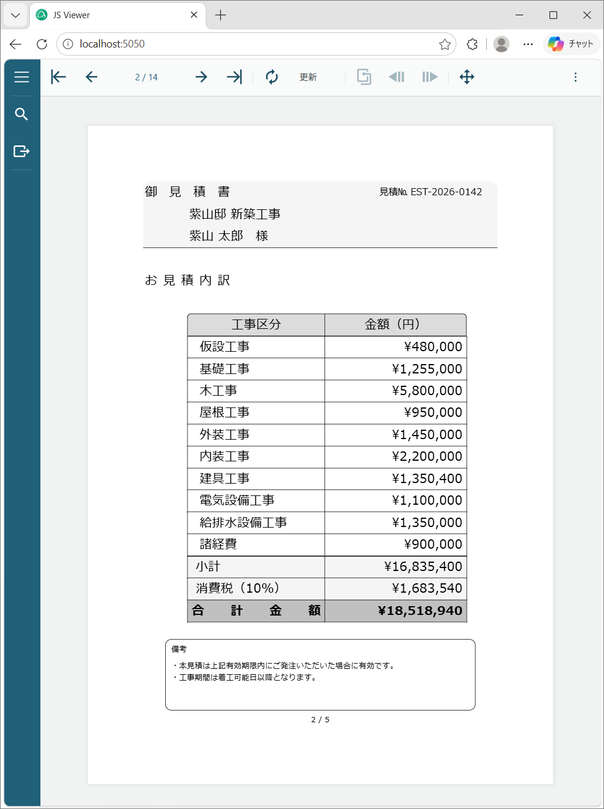
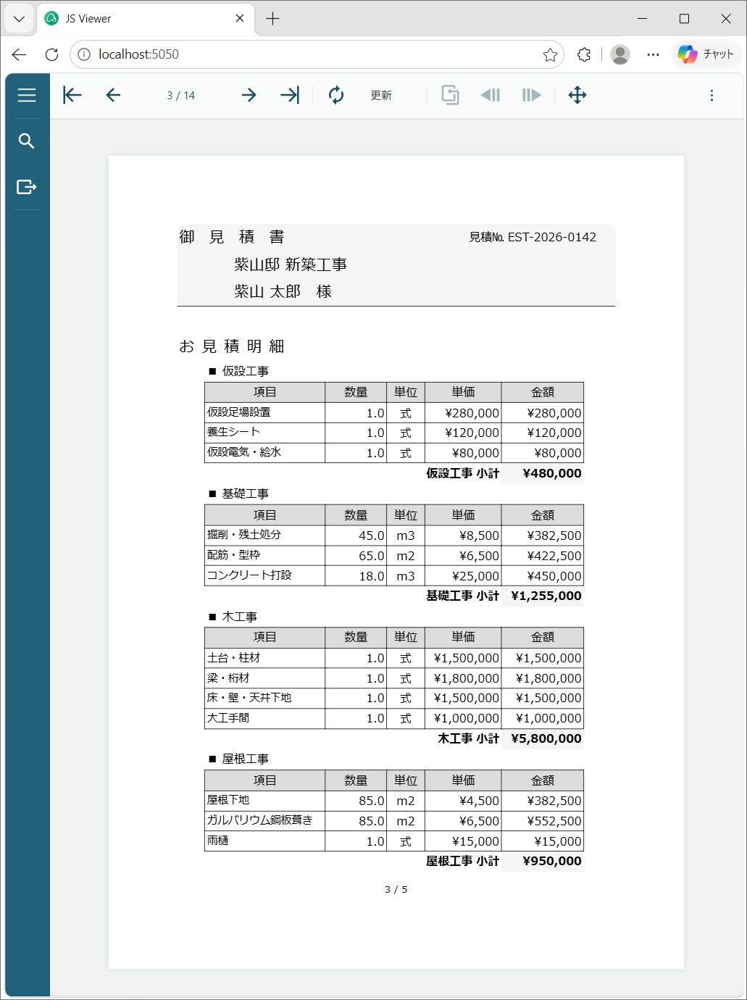

# PageReportsASPCoreApp

ActiveReports for .NETの**ページレポート**を使用した複数ページレイアウト帳票の実装サンプルです。

	
	
	

## 概要
このソースコードは、MESCIUS公式技術ブログの記事シリーズに基づいて実装されています。

**参考記事：**
- [これからはじめるActiveReports帳票～ページレポート実践編（1）](https://devlog.mescius.jp/activereports-pagereports-practical-1/)
- [これからはじめるActiveReports帳票～ページレポート実践編（2）](https://devlog.mescius.jp/activereports-pagereports-practical-2/)

## 記事の内容概要

### 第1回：準備編
ActiveReports 18.0Jから最新版への移行、.NET 10への対応、複数ページレイアウト用の基本的なレポート構成の設定について解説しています。見積書に必要な5つのデータセット（ヘッダ、明細、クライアント、受注者、現場代理人マスタ）の準備方法を紹介しています。

### 第2回：実践編
建設業の見積書を題材に、実際の多ページレイアウト帳票の実装方法を詳しく解説しています。**ページグループ**による複数ページの繰り返し、**Lookup関数**によるマスターデータの参照、テーブルの集計機能など、実務的なレポート設計パターンを実装しています。

## 帳票の特徴

ページレポートでは、**1つの帳票に複数のページレイアウトを持たせることができます**。ページごとに異なるデザインを適用することで、実務的な帳票設計が実現します。

このプロジェクトでは、建設業の見積書を例に、以下の3ページ構成を実装しています：

- **表紙ページ** - 見積書全体の概要（タイトル、顧客名、プロジェクト詳細、税込合計金額）
- **集計ページ** - 工事種別ごとのコスト内訳と集計
- **明細ページ** - 工事種別ごとに整理された明細項目（数量、単価、金額）

## 技術スタック

- **ActiveReports for .NET** - Page Reports機能を使用した帳票設計
- **.NET 10** - ターゲットフレームワーク
- **ASP.NET Core** - Webアプリケーションフレームワーク

## 実装されている主要な技術パターン

- **ページグループ** - 見積番号ごとに3ページセットを繰り返し
- **Lookup/LookupSet関数** - マスターテーブルからのデータ参照
- **テーブルコントロール** - グループ化と集計による工事種別ごとのサマリー
- **図形コントロール** - 装飾的な枠線と背景の設定
- **フィルタリング** - 見積書ごとの関連レコードの表示制御
- **セクション別ページ番号** - 見積グループごとのページ番号リセット
